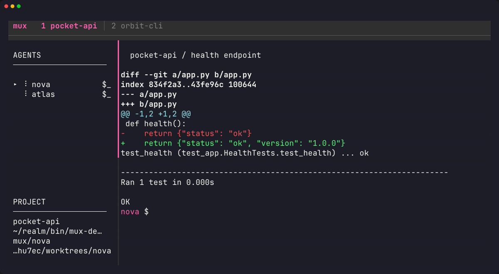

# mux

run your coding agents across projects, from one terminal.

i built this because setting up tmux panes every time i wanted a few agents on a repo was getting annoying. mux handles that part. open a project, pick an agent, start working.

projects get tabs. agents get a sidebar. the selected agent runs in a real tmux pane. you can switch between claude, codex, gemini, cursor and a normal shell.

[](docs/demo.gif)

[watch the full-size video](docs/demo.webm)

## prerequisites

- Linux or macOS with a terminal and a shell. on Windows, use WSL.
- `tmux` 3.2 or newer.
- `git` for repo discovery and worktrees.
- Go 1.25.8 or newer to build and install mux.
- `curl` if you use the installer below.
- whichever agent CLI you want to use, installed, on `PATH` and signed in.

you don't need every provider installed. just one is fine. the shell option works without any agent CLI.

| provider | executable mux looks for |
| --- | --- |
| claude | `claude` |
| codex | `codex` |
| gemini | `gemini` |
| cursor | `cursor-agent` |

missing providers are dimmed in the picker.

## install

```sh
curl -fsSL https://raw.githubusercontent.com/Amansingh-afk/mux/master/install.sh | sh
```

the installer checks Go, git and tmux, then builds mux using `go install`. it installs to `~/.local/bin`. no sudo, no changes to your shell config.

if that directory is not on your `PATH`, add this to `~/.zshrc` or `~/.bashrc`:

```sh
export PATH="$HOME/.local/bin:$PATH"
```

open a new terminal, then run:

```sh
mux
```

rerun the installer to update. to choose a directory or version:

```sh
curl -fsSL https://raw.githubusercontent.com/Amansingh-afk/mux/master/install.sh \
  | MUX_INSTALL_DIR="$HOME/.local/bin" MUX_VERSION=master sh
```

`MUX_VERSION` accepts a branch, tag or commit. the default is `latest`.

### with Go

```sh
go install github.com/Amansingh-afk/mux/cmd/mux@latest
```

Go installs to `GOBIN` if set, otherwise its usual `GOPATH/bin` directory, normally `~/go/bin`. make sure that directory is on your `PATH`.

### from source

```sh
git clone https://github.com/Amansingh-afk/mux.git
cd mux
go build -o mux ./cmd/mux
./mux
```

## quick start

1. run `mux`. it starts tmux for you if needed.
2. press `Alt+o` and choose a project.
3. press `Alt+n` and choose an agent.
4. type your prompt in the agent pane.
5. use `Alt+j` / `Alt+k` to switch agents and `Alt+h` / `Alt+l` to switch projects.

need a shell? press `Alt+s`. it does the same thing as choosing shell from the agent picker. it opens in the current project and shows up in the same sidebar.

## shortcuts

`M` means Alt. `C` means Ctrl. uppercase letters also need Shift.

Alt shortcuts work from the sidebar and inside agent panes. mux saves existing tmux bindings for these keys and restores them when it exits normally. set `quick_nav = false` to keep shortcuts local to the mux pane.

### projects

| key | action |
| --- | --- |
| `M-o` | open a project |
| `M-h` / `M-l` | previous / next project |
| `M-Left` / `M-Right` | previous / next project |
| `M-1` to `M-9` | jump to a project tab |
| `M-w` | close tab, keep agents running |
| `M-W` | close tab and kill its agents |

### agents

| key | action |
| --- | --- |
| `M-n` | choose a provider and spawn an agent |
| `M-s` | spawn a shell in the current project |
| `M-j` / `M-k` | next / previous agent |
| `M-Down` / `M-Up` | next / previous agent |
| `enter` | attach or resume, with mux focused |
| `M-space` | switch focus between mux and agent |
| `M-r` | rename agent |
| `M-i` | adopt an existing provider session |
| `M-x` | kill agent; press again to forget it |
| `M-z` | toggle fullscreen agent view |
| `M-q` | quit mux |

with the default tmux prefix, `C-b z` also exits fullscreen.

### with mux focused

| key | action |
| --- | --- |
| `c` / `C` | copy worktree path / branch name |
| `y` / `p` | grab agent output / paste it into another agent's prompt |
| `?` | help |
| `q` / `C-c` | quit |

pasted output is not submitted automatically. review it and press enter.

`M-b`, `M-f`, `M-d`, `M-.`, `M-y` and `M-p` are left alone for shell navigation and editing.

## worktrees

coding agents spawned in a git repo get their own worktree and a branch named `mux/<codename>`. the branch starts from the project's current HEAD. shells and agents in non-git directories use the project directory directly.

worktrees live under `~/.local/share/mux/worktrees/`, or `$XDG_DATA_HOME/mux/worktrees/` if set. the sidebar shows the selected agent's branch and worktree path.

review and merge with normal git commands. for example, if your base branch is `main`:

```sh
git diff main...mux/nova
git merge mux/nova
```

these commands work on committed changes. ask the agent to commit its work first, or inspect uncommitted changes inside its worktree.

forgetting an agent removes its worktree, including uncommitted changes and untracked files. commit anything you need before forgetting it. unmerged branches are kept; merged branches are deleted.

for gitignored files the agent needs, such as `.env`, list them in `.worktreeinclude` at the repo root. matching ignored files are copied into new worktrees. it uses gitignore patterns.

for dependency setup:

```toml
[worktree]
setup = "pnpm i"
```

this command runs in each new worktree before the agent starts.

## resume and adopt

when an agent's tmux session is gone, it stays in the sidebar as dead. press enter to resume it. mux uses the saved provider session ID when available, otherwise it falls back to the provider's resume behaviour.

`Alt+i` lists discoverable provider sessions for the current repo. choose one to add it to mux, then press enter to resume. this is useful if you started a conversation outside mux.

## status

agents show as active, waiting, idle or dead. the project tabs show how many agents are waiting for input. the sidebar also shows token usage when transcript data is available.

mux uses provider events and transcript activity where supported, with terminal output checks as a fallback. set `native_status = false` to disable injected provider hooks.

## config

optional config lives at `~/.config/mux/config.toml`, or `$XDG_CONFIG_HOME/mux/config.toml`.

```toml
[general]
discovery_roots = ["~/work", "~/oss"]
native_status = true
quick_nav = true

[worktree]
setup = "pnpm i"

[providers.claude]
args = ["--model", "opus"]

[providers.aider]
cmd = "aider"
args = ["--watch-files"]
hint = "pip install aider-chat"
color = "39"
```

leave out sections you don't need. no config file means defaults. invalid config stops startup with an error; unknown keys produce a warning.

agents get a codename automatically. use `Alt+r` to change it.

## notifications

create an executable script at `~/.config/mux/hooks/on_waiting.sh`. this path also respects `XDG_CONFIG_HOME`.

example for Linux with `notify-send` and a running notification daemon:

```sh
#!/bin/sh
msg="ready for review"
if [ "$MUX_REASON" = "permission" ]; then
    msg="needs permission"
fi
notify-send "mux: $MUX_AGENT_NAME $msg" \
    "$MUX_AGENT_PROVIDER in $MUX_PROJECT_NAME"
```

```sh
chmod +x ~/.config/mux/hooks/on_waiting.sh
```

hooks receive JSON on stdin and these environment variables:

```text
MUX_EVENT
MUX_AGENT_ID
MUX_AGENT_NAME
MUX_AGENT_PROVIDER
MUX_PROJECT_NAME
MUX_PROJECT_PATH
MUX_STATUS_PREV
MUX_STATUS_NOW
MUX_REASON
```

`MUX_REASON` can be `permission`, `done` or `ended`, or empty when the status came from terminal output checks. the hook runs on an active-to-waiting transition, with a 30-second cooldown per agent and a 5-second timeout.

## development

```sh
go test ./...
go build -o mux ./cmd/mux
```

```text
cmd/mux           entrypoint and provider callbacks
internal/tui      sidebar, pickers and pane control
internal/session  tmux, providers, worktrees and session discovery
internal/state    saved projects and agents
internal/discover repo discovery
internal/config   config loading
internal/hooks    event hooks
```

built with Bubble Tea, Lipgloss and tmux. tmux handles the terminal sessions. mux handles organising them.

## license

MIT. see [LICENSE](LICENSE).
